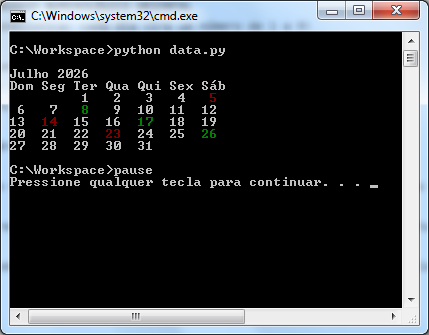

# 📆 CALENDÁRIO NUMEROLÓGICO ORIENTAL
🔮 Soma Cabalística: cada dia vira um número de 1 a 9!

✨ Destaques:
🟢 Verde = SORTE (7) – dias abençoados!
🔴 Vermelho = AZAR (4) – cuidado, evite decisões importantes.

📅 Calendário mensal interativo: veja na hora qual a energia do dia!

🧘 Baseado na cultura oriental, que valoriza o 7 como sorte e o 4 como desarmonia.

💡 Use para: planejar viagens, reuniões, ou só por curiosidade espiritual!

🔁 Rode todo mês e compartilhe com quem gosta de numerologia e misticismo.

---

### Print

